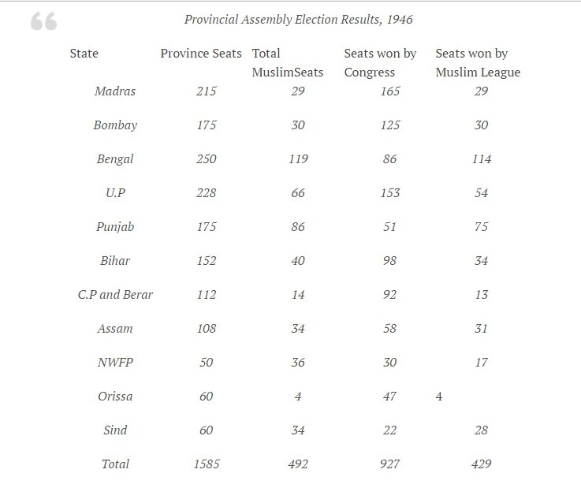

  

## Intro

Muslim society has a pernicious effect on non-muslim (especially polytheistic) societies. This is the cost of the short-term fitness-gain of the muslim pyramid scheme, as described in the [fitness-effect page](../fitness-effect/).

- Even when muslims are in the minority, the riot-manual injunctions of[sura At-Tawba](http://en.wikipedia.org/wiki/At-Tawba)have been realized repeatedly.
    - Claims such as "there were no hindu-muslim riots before the British era", or "our temples were destroyed by armies and tyrants alone, none by ordinary rioters" are false. (Eg.[K](http://manasataramgini.wordpress.com/2013/07/22/a-sayyid-kills-a-kashmirian-yogin/),)
    - Many of the "battles" quoted in early islamic history are actually best charactarized as riots, with 10-200 hooligans fighting pagans.
- The "victim narrative" is applied to generate anger and a pan-islamic response.
- Military betrayal (described below).

## Economic damage to society

- Indian economic share went down due to the trauma of Islamic invasion. \[[At16](http://www.theatlantic.com/business/archive/2012/06/the-economic-history-of-the-last-2-000-years-in-1-little-graph/258676/)\]
- 

### Economic punishment

- About a certain Islamic ruler of India: "Muslims were exempted from paying the housetax and taxes on grain and other goods meant for their personal use. Hindus converting to Islam were exempted from specific taxes. Special attention was given to the education of Muslim children. Towards the end of his reign Muslims made up a very large majority of his senior most nobility."
- "Or consider historian Prof. KS Lal’s works on caste and religion, refuting with primary data the seeming truism, launched by the Communist Party ideologue MN Roy and now omnipresent in the textbooks, that the lowest castes converted en masse to Islam because of its claimed message of equality. Islam mainly won over the urban middle castes (and not because of eguality, a value rejected as ingratitude towards the Dispenser of destinies in the Quran, but because of the privileges vis-à-vis non-Muslims), not the Untouchables. Again, the silent treatment has been the only response the “experts” could muster." \[[KE16](http://www.pragyata.com/mag/academic-bullies-278)\]

### Parasitic relation to the other

A summary from @parikramah:

- 1\. The jihadi mindset has a split personality of violent dominance or wailing demand w.r.t. Other, & an antipathy to mundane work.
- 2\. Qur'an 8.69 etc make it clear that the normal situation is for the jihadi to live off the kuffar. Many modes are listed.
- 4\. But also in a state of Dar-ul-Harb, via other soft means, making demands for concessions. The Anjem Choudarys live off dole.
- 5\. After British occupation, Indian Muslim Ashraf complained of the "mulazimana zehniyat" (slave mentality) of 9-5 work culture.
- 6\. Loss of sinecures and privy purses, having to compete with kuffar as employees for a living - considered "slavish" by Ashraf.
- 7\. That is "ghanaa" (plenitude) attitude. Next is "faqr" - demands made in "poverty". Both speak from moral high ground.
- 8\. Thus, Sufi "faqeers" ("poor") appeal to  conscience, demanding sustenance - from moral high ground. Like Buddhist bhikshus.
- 9\. Whether in ghanaa or faqr mindset, goal is to live off the Other: "Allah ke naam pe loonga baba" "Allah ke naam pe de de baba"
- 10\. The Other is non-Muslim, or impure Muslims. Many Sufi tariqats considered other Muslims worldly & kuffar. Yet lived off them.

## Criminal activity

- "The findings: about 80% of the criminals at the petty-crime level were Muslims, that figure decreasing when it came to white-collar crime. Please note that under the Indian Penal Code, petty crime includes armed robbery, dacoity and attempted murder - all of which carry heinous penalties by Shariat, which was the point in discussion." \[[RED](http://www.rediff.com/news/sep/05varsha.htm) 2005 varShA\]

## Military and national Betrayal

- Dominant Islamic thought requires betrayal of ones country to further the interests of Islam.

### Vijayanagara
- Betrayal of two Muslim commanders of Vijayanagara Army at key point in the battle, was the chief cause of the defeat in tAlikoTa. \[\]
- Rama Raya was not a Muslim hating figure.
- Primary sources :
    - Federici Caesaro, the Venetian traveller reports on the betrayal of about 80k soldiers led by two captains.
        - "Father Heras, in Page 211 of his 'Aravidu Dynasty' book, quotes a contemporary European named C. Frederick, 'who heard the account of whole action one year later when he passed through Vijayanagara'. Heras also mentions one Anquetil du Perron, another European of 16th century who wrote "the king \[Ramaraya\] abandoned during the battle by two Muhammadan chiefs, perished."." \[[MH17](http://www.madhvahistory.com/index.php/13-member-articles/accounts-of-empires-kingdoms/39-battle-of-talikota-completes-450-years)\]
    - Tazkiratul – Muluk written by Rafiuddin Shirazi who wrote a history of his patron kings, the Adil Shahis of Bijapur. (Shirazi travelled from Persia and reached Bijapur in 1560.) makes no mention of them.
    - Ferishta’s account does not mention them.
- Secondary sources:
    - K A Nilakanta Shastri History of South India pg267
    - Sitaram Goel [here](http://indiafacts.co.in/remembering-a-karmayogi/).
    - [Dancing girl](http://books.google.com/books?id=980SAvbmpUkC&pg=PT269&lpg=PT269&dq=vijayanagara+betrayal+ramaraya+talikota&source=bl&ots=vA6xZ0z_oy&sig=PYpk1L1L9Z2hFXzs1_A2R-5behA&hl=en&sa=X&ei=EGTSU_TLJuH8igL78IGQBw&ved=0CEYQ6AEwBQ#v=onepage&q=vijayanagara%20betrayal%20ramaraya%20talikota&f=false).
    - [Toshkana](http://toshkhana.wordpress.com/2011/10/28/last-of-the-rayas-an-eyewitness-account-of-the-defeat-and-death-of-rama-raya-of-vijaynagara-at-talikota/).

### Abdali invitation
- The sufi Shah Waliullah Dehlawi, a venerated scholar, invited Ahmad Shah Abdali of Afghanistan to attack the Maratha in third battle of Panipat and advised his collaborator Najib al Dawla to launch jehad against Jats. Excerpts:
    - "It has become clear to my mind that the kingdom of heaven has predestined that kafirs should be reduced to a state of humiliation and treated with utter contempt. Should that repository of majesty and dauntless courage (Nizam al-Maluk) gird his loins and direct his attention to such a task he can conquer the world. ... Should he make no effort, they (the Marathas) would inevitably be weakened and annihilated through celestial calamities and in such an event he would gain no credit…As I have learnt this unequivocally (from the divine) I spontaneously write to draw your attention to the great opportunity laid before you. You should therefore not be negligent in fighting jihad."
    - "We beseech you in the name of Prophet to fight a jihad against the infidels of this region… The invasion of Nadir shah, who destroyed the Muslims, left the Marathas and Jats secure and prosperous.  This resulted in the infidels regaining their strength and in the reduction of Muslim leaders of Delhi to mere puppets" ( Shah Wali Allah and his times by Saiyid Athar Abbas Rizvi, page page305).
    - "…All control of power is with the Hindus because they are the only people who are industrious and adaptable.  Riches and prosperity are theirs, while Muslims have nothing but poverty and misery.  At this juncture you are the only person, who has the initiative, the foresight, the power and capability to defeat the enemy and free the Muslims from the clutches of the infidels.  God forbid if their domination continues, Muslims will even forget Islam and become undistinguishable from the non-Muslims" (Dr. Sayed Riaz Ahmad in his book 'Maulana Maududi and Islamic state' - Lahore People's Publishing House, page 15 - 1976). 

### INA sabotage and desertion
- Sabotage and desertion in the Indian National Army (INA) - [TW15](https://twitter.com/Rjrasva/status/589763559522963456?s=09).
- Recruitment to safeguard muslim interests [TW](https://twitter.com/Rjrasva/status/589762467238129664). 
- Later ex-INA servicemen were used by pAkistAn in their kAshmIr plunder \[[ChFair](http://i.imgsafe.org/e9b1431594.jpg)\]. "In 1947, Bhimber Tehsil had 35% Hindus + Sikhs. Habibur Rehman, a former aide of Subhas Bose launched a Kabali Jihad on Bhimber."  

### Gilgit scouts
- Sabotage, defection and revolt of Gilgit scouts, frontier Gilgit rAja-s and the Poonchi muslim troops of Narain singh - [TW16](https://twitter.com/maidros78/status/769913255766683649).
- Officer Nidal Malik Hasan's shooting spree in a US army base \[[wiki](https://en.wikipedia.org/wiki/Nidal_Malik_Hasan)\].        

### Pakistan creation and the fifth column
- An overwhelming majority of muslims declared their unwillingness to live in a hindu majority democracy and ushered in the partition. Alas, a significant fraction of them stayed back anyway to form an inimical fifth column sympathetic to Pakistan.
  - In the 1946 provincial assembly elections, the Muslim League captured 4.5 million of about 6 million Muslim votes. So, 75% of Indian Muslims voted for the Muslim League and its demand for Pakistan. (One can probably even dig up district-wise statistics. I recall it was 90% of UP, Delhi.) But 75% of Indian muslims in various regions did not go to pAkistan despite voting for it. Though a small "elite" fraction of the adult population were eligible to vote - one can hardly say that this sample was not representative of the rest of the muslim population. 
  - > 
  - [Indian annual register 1946 v1 p229](https://archive.org/details/in.ernet.dli.2015.45831/page/n243)
- Sardar Patel (Calcutta maidan 03-Jan-1948) asked how the Muslims remaining in India after partition suddenly claim loyalty to India: [YT1](https://www.youtube.com/watch?v=x1URZmiFsUg)

### Other history
- Muslim response to Hindu patronage and protection \[[VoD](http://voiceofdharma.org/books/htemples2/ch3.htm)\].
- Repeated moplah outrages in keraLa 1849-1923. [Tw](https://twitter.com/dasyavevrka/status/629284144023908352/photo/1), [TwImg](http://i.imgur.com/sSZ4d6k.png), [GB](https://books.google.com/books?id=75ZeAAAAcAAJ&pg=PA30&lpg=PA30&dq=%22levied+loans+from+rich+Hindoos%22&source=bl&ots=4TSs_tdQyK&sig=Mavcs1U8ZZPp-lbwEMdFEHrbDw4&hl=sa&sa=X&ved=0CBsQ6AEwAGoVChMItPbWnJCVxwIVWCqICh2SIQqL#v=snippet&q=destroyed&f=false).

- As treacherous neighbors
    - During the 2014-15 attacks of the Islamic State in Iraq and Syria on Yazidis and Christians:
        - "Worst killings came from our (Sunni) Muslim neighbors".. (Yazidi [report](http://news.yahoo.com/iraq-yazidis-neighbours-enabled-jihadist-attack-095139064.html), [Vid1](https://twitter.com/Thawra_city/status/871289293146267649), Christian confirmation: [memri1](http://www.memri.org/clip_transcript/en/4414.htm), [memri2](http://www.memri.org/clip/en/0/0/0/0/0/0/4414.htm), ([MEF2015](http://www.meforum.org/5371/why-muslims-bad-neighbors))).
    - This was also observed during the partition of India (FB15).

### Contrast with others
- Contrast with military betrayals by followers of other belief systems:
    - Buddhist betrayal of their nation is rare and is contrary to buddha's teachings.

## Inhibiting religious practice.

- chaitanya-mangala, vijaya gupta's poem on Husain Shah summarized [here](http://i.imgur.com/Nktg3CY.png) ([book](http://www.voiceofdharma.org/books/siii/ch10.htm) \- Caveat: Goel [misattributes vijaya-gupta-quote](https://www.google.com/search?tbm=bks&q=The+wicked+mlechhas+pollute+the+religion+of+the+Hindus+every+day&cad=h) to gangAdEvI).

## Consciousness of demographic projection differences

- Erdogan to EU muslims: "make 5 kids" \[[E17](https://www.rt.com/news/381166-erdogan-turks-five-children/)\]  

## Temple and university destruction.

- This can happen as government policy or as a matter of riots.
- Summary: Muhammad's example as \*the ideal muslim\* has motivated murderers and pillagers throughout the ages, including in my country. Like early christians who burnt down the library of Alexandria, they destroyed the great universities of naLandA and vikramashIlA, the temples they razed are too numerous to count - zarathruShTa's favorite tree, the sphynxes nose, tombs of Timbuktu, buddha-s of bAmiyAn being well known examples in the wider world.

### Iconoclasm

- Islamic iconoclasm is well known. Some salient examples are given below.
    - Saudi Arabia and the middle east:
        - muhammad and the idols at kAbA.
        - Nose of the sphynx.
        - The tree planted by ZarathruShTa.
        - ISIL kalIf
            - Yazidi temples.
            - Museum vandalism and library burning - [DM201502](http://www.dailymail.co.uk/news/article-2970270/Islamic-State-fighters-destroy-antiquities-Iraq-video.html). [Nimrud](http://www.nytimes.com/2015/03/06/world/middleeast/isis-attacks-iraqi-archaeological-site-at-nimrud.html?smid=fb-share&_r=1). Palmyra.
        - Lybia - [NYT15](http://www.newyorker.com/magazine/2015/02/23/unravelling): Under a line of vandalized bas-reliefs, I saw a spray-painted message in Arabic script: “Destroy the stone idols, no to restoration.”
    - India:
        - Northern jihads:
            - Comparison of religious sites 8-12 ce vs 12-15 ce : [here](https://twitter.com/vvkbkvv/status/523883328882368513).
            - mahmUd of ghazni's attacks on somanath
            - sikandar bhut-shikAn in kAshmira
            - kAlA-pahAD in orissa
            - awrangzeb: several cases; especially kAshi vishvanAtha temple, somanAtha temple, Keshav Rai temple of mathura (idols were brought to Agra and layed under the steps of Jahanara's mosque), temples in Someshwar and Udaipur.
            - Numerous mosques clearly show evidence of being built upon or using material from Hindu temples.
                - Quwwat-ul-Islam_Mosque near Qutb Minar \[[Wiki](https://en.wikipedia.org/wiki/Qutb_complex#Quwwat-ul-Islam_Mosque)\].
            - TSP:
                - Multan/ Kaffirkot ([MT1](https://paper.li/vAsukeya/1414422064#!photos), [TW1](https://twitter.com/blog_supplement/status/581327521272197120))
                - Surviving temples : [SW1](http://swarajyamag.com/magazine/faith-under-a-shadow/).
        - Southern jihads:
            - Ruins of Hampi, Halebid.
            - tales of Shrirangam
            - Vandalism at the Maldives museum (2012) [NYT](http://www.nytimes.com/2012/02/14/world/asia/political-turmoil-threatens-archaeological-treasures-in-maldives.html?_r=0).
    - Afghanistan and Xinjiang:
        - buddha-s of bAmiyAn trashed by awrangzeb and more recently by tAliban.
        - In nearby Dunhuang, in the Chinese province of Xinjiang, many buddha statues were defaced, beheaded.
    - Japan:
        - Saudi student destroying buddhist statues (2014) - [NHK](https://www.youtube.com/watch?v=nku91rSCSdM).
- Other examples of anti-iconography sentiment: snowman [fatwa](http://www.washingtonpost.com/blogs/worldviews/wp/2015/01/13/frosty-fatwa-saudi-cleric-bans-snowmen/), maldives museum [attack](http://www.nytimes.com/2012/02/14/world/asia/political-turmoil-threatens-archaeological-treasures-in-maldives.html).

  

### Limited digestion of polytheism and icon worship

Sufi and shia dargah-s provide for some limited outlet for polytheistic and iconophilic tendencies.

### Destruction of centers of learning.

- Central Asia:
    - "The Moslem scientist Al-Biruni himself informs us that in the major cities of Khwarizm, Qutayba demolished huge libraries and burnt their numerous Indic and Iranic texts. Al-Biruni also mentions that he systematically killed all the Indic and Iranian scholars who manned those libraries." \[[M](http://www.indiafacts.co.in/isis-caliphate-lessons-earliest-mohammedan-invasions-central-asia/)\]
    - "Every historian and archaeologist of that period knows that the vast Buddhist and Jain establishments at Bukhara, Samarkand, Khotan, Balkh, Bamian, Begram, Jalalabad, Peshawar, Takshasila, Mirpur-Khas, Nagar-Parkar, Sringar, Sialkot, Agroha, Mathura, Hastinapur, Kanauj, Sravasti, Ayodhya, Sarnath, Nalanda, Vikramsila, Vaishali, Rajgir, Odantpuri, Bharhut, Paharpur, Jagaddala, Jajnagar, Nagarjunikonda, Amaravati, Kanchi, Dwarasamudra, Bharuch Valabhi, Palitana, Girnar, Patan, Jalor, Chandrawati, Bhinmal, Didwana, Nagaur, Osian, Bairat, Gwalior and Mandu were destroyed by the swordsmen of Islam." \[[SG](http://voiceofdharma.in/hindu-temples-what-happened-to-them-vol-1/some-historical-questions)\]
- In India the great universities at Nalanda and Vikramashila were destroyed; schools in Kashi, Multan and Thatta were suppressed.
- Claim: "Universities were nice things but not essential to Hindu survivial."
    - Hindu-s do and did have centers of learning, where students and teachers congregated. These were critical to the efflorecence of hindu thought.
        - “The padishaw, cherisher of Mohammedanism learned that in the provinces of Thatta, Multan and especially at Benaras, the brAhmaNa infidels used to teach their false books in their established schools, and their admirers and students, both Hindu and Muslim, used to come from great distances to these misguided men in order to acquire their vile learning. His Majesty, eager to establish Islam, issued orders to the governors of all the provinces to demolish the schools and temples of the infidels, and, with the utmost urgency, put down the teaching and the public practice of the religion of these unbelievers (imperial decree of 9th April 1669).” \[Secondary source: [M](http://manasataramgini.wordpress.com/2014/02/04/some-notes-on-the-extra-military-aspects-of-the-islamo-hindu-confrontation/)\]
        - Even during the British era, it was fairly common for scholars from southern India to soujourn to Kashi to gain advanced knowledge and prove their mettle. Even today in southern weddings, the groom ritually expresses his desire to go to Kashi (the motivation bein both religious and educational) before being ritually enticed into staying home.
            
    - Of course, much knowledge was diffuse and preserved in households. But, much "advanced learning" was lost. The example of several lost hindu traditions based in kAshmIra and in Sindh are prime examples of this.

## Other cultural degradation

### Cruelty to culturally important animals

- Torturing dogs in zoroastrian areas of Iran \[[arch](https://archive.org/stream/APersianStrongholdOfZoroastrianism/BoyceMaryaPersianStrongholdOfZoroastrianism#page/n79/mode/2up)\]
- Cow killing in India.
  - "‘Ala Hazrat’ the founder of Barelvis, arguably one of the top “reformers” of the Indian Mohammedans of the last century, wrote a Fatwa tract in early 1900s entitled Qurban-ul-Bakr, that made it mandatory for Indian Moslems to slaughter Cow instead of other animals. He said a particular thing becomes mandatory for M in reaction to any initiative that dilutes the full limits of Sharia. Therefore, he argued, since some want M to give up cow slaughter and use other animals since Sharia allows it, while it is normally fine, but because it “limits” the practice to reduced allowance of full Sharia, it becomes mandatory for Muslims to react by slaughtering cows only. Normally it would have been permissible but in reaction, it is mandatory."  {[YT](https://youtu.be/Gxw6okCPURA?t=678)}
